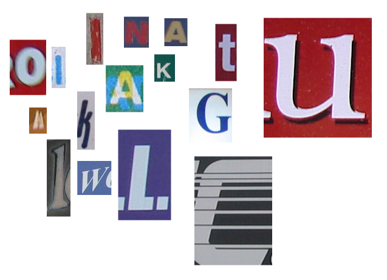

鐵人賽30天也差不多過一半了，雖然把這個系列放在big data底下，但是所有的篇幅都在介紹julia的語言特性和實作，實在有點心虛。最近要想來開始花一點來看如何把julia應用在big data的分析和運算。

正好最近Kaggle推出了一個競賽叫做[First steps with Julia](http://www.kaggle.com/c/street-view-getting-started-with-julia)，主要目的是要推廣julia這個新的程式語言。這個競賽是在Kaggle的101分類底下，所以競賽的成績不會計入個人的總積分，當然也沒有獎金，for fun and knowledge。而這個First steps with Julia的資料和指南當然就是我們試刀的最好材料。

這個競賽的題目是要辨識google街景圖裡面抓下來的字元，內容像下圖這樣:

Kaggle網站上提供了兩個tutorial，讓julia的初學者可以很快地見識julia的能力。其中一個[tutorial用了random forest來做辨識](http://www.kaggle.com/c/street-view-getting-started-with-julia/details/julia-tutorial)，而另一個[tutorial則是用了k nearest neighbor (KNN) method](http://www.kaggle.com/c/street-view-getting-started-with-julia/details/knn-tutorial)。

random forest是一個非常有效的統計學分類方法，這邊就不解說了。對這個方法不熟的人，我建議去看standford的這門[線上課程](https://class.stanford.edu/courses/HumanitiesScience/StatLearning/Winter2014/about)裡面有關decision tree和random forest的那一課。許多machine learning課程是難度和用語是接近數學系和資訊系那一邊的，但是這門課主要的對象是人文科學和社會科學的學生，所以解說的方法比較直覺，可以用來很快地抓到decision tree和random forest的精神。附帶一提，課堂用的教科書的pdf檔也是可以下載的，那是本好書，請務必珍藏。

Kaggle的tutorial用random forest來分析這個資料集的方法如下:
1)先把所有的影像都rescale到相同的大小
2)把所有影像轉成灰階
3)用random forest做classification

而我們需要幾個外部套件執行這件工作，分別是[DataFrames](https://github.com/JuliaStats/DataFrames.jl), [Images](https://github.com/timholy/Images.jl), [DecisionTree](https://github.com/bensadeghi/DecisionTree.jl)

DataFrame之於julia就有如pandas之於python，是用來處理表格式資料的工具。Images是處理影像的工具，我們主要是用這個套件來讀取bmp檔，然後轉成julia的Array進行進一步的處理，而DecisionTree則是用來做random forest的運算。julia是很年輕的語言，而這些套件的年紀也不會很大，用起來有bug或是文件不夠完整也是難免的，所以有很多機會可以表現我們的hacker精神 :p

今天就先簡介到這邊。上面解法的原始碼和測試資料都可以在Kaggle的[下載頁面](http://www.kaggle.com/c/street-view-getting-started-with-julia/data)上下載。如果我自己的時間夠的話，再放上一些我自己的做法給大家參考。

